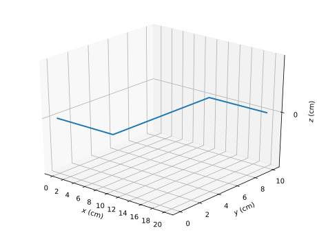
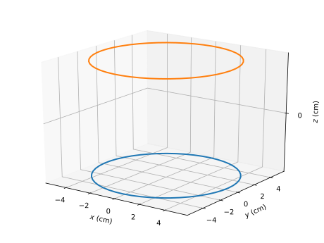
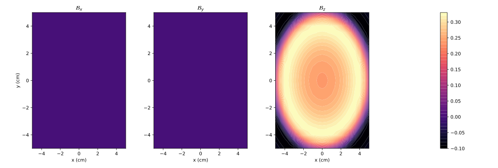
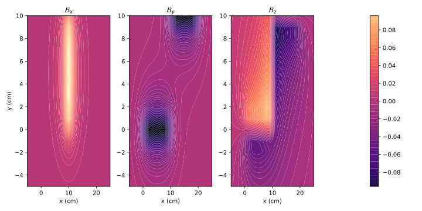

# Biot-Savart Magnetic Field Calculator

This tool numerically solves for the 3D vector magnetic field around an arbitrarily shaped coil specified by the user, in a discrete and finite volume surrounding the coil. The code is optimized to use NumPy vectorization, and uses Richardson extrapolation to get the best accuracy for a specified mesh size.

Latest Version: V4.3 (June 20, 2020)

By Mingde Yin and Ryan Zazo

[](https://creativecommons.org/licenses/by-nc-sa/4.0/)

# Basic Overview of Functionality
Given an input coil, the tool can both calculate, and plot the magnetic field vector over a finite discrete volume of space around the coil.

The coil is passed into the program as a set of vertices describing the geometry of the coil, as well as the amount of current flowing through a given segment of the coil. (See **Formatting** section)

A *target volume* is produced as a series of points within a rectangular prism bounding box around the coil. The magnetic field at each point in the target volume is obtained by numerically integrating using the Biot-Savart law, resulting in a 4D array of size (X, Y, Z, 3) as the output, which is saved to a file using `numpy.save()`.

The entire process of producing the finished target volume is done through the function `write_target_volume()`.

A calculated target volume can be loaded in using `read_target_volume()`. This target volume array can then be plotted using the built-in plotting functions.


# Installation
* Have Python 3.x installed
* Install `numpy` and `matplotlib`
* Clone or download the repository to your machine

# Data Input and Calculating the Field

You can produce and calculate a target volume using `write_target_volume()`, which writes a calcualted target volume to a file which can be loaded and used later using `read_target_volume(filename)`.

Parameters Breakdown
* `input_filename`: Name of input file. See **Coil Format** for details
* `output_filename`: The name of the file in which we store the finished target volume.
* `box_size`: (x, y, z) tuple with the dimensions of the target volume in cm
* `start_point`: (x, y, z) tuple representing the bottom left corner spatial position of the target volume (with respect to the coil) AKA the offset
* `coil_resolution`: How long each discretized coil subsegment should be, in cm
* `volume_resolution`: Division of volumetric meshgrid (generate a point in the target volume every volume_resolution cm)

Increasing `coil_resolution` affects runtime linearly, whereas increasing `volume_resolution` increases runtime cubically.

`coil_resolution` can be reduced to around 0.01 cm with acceptable results, and `volume_resolution` should be kept no lower than 0.1 cm. We recommend using 1 cm for both, if you can tolerate it.


#### Coil Format
The coil is represented as a series of (X,Y,Z) coordinates which define the vertices of the coil spatially, along with an additional coordinate (I) which defines the amount of current flowing from that vertex to the next one.

* Plaintext file
* The file contains each (X,Y,Z,I) entry on a new line
* The format of each line should be `"x,y,z,I\n"`

For instance:
```
0,0,1,2
0,1,1,3
1,1,1,4
```
Means that:
- There are 2 amps of current running between points 1 and 2
- There are 3 amps of current running between points 2 and 3
- The last bit of current is functionally useless.


An Example Coil (`coil.txt`):
```
0,0,0,1
10,0,0,1
10,10,0,1
20,10,0,1
```

Here's what the coil looks like (`coil.svg`), plotted using `plot_coil("coil.txt")`.




#### Understanding the Coordinate System and Indexing a Finished Target Volume
All positions in this program are described with respect to the position of the coil. This means, for the above coil, a `box_size` of `(10, 10, 10)`, with a `start_point` of `(-5, -5, -5)` creates a box with its middle centred about the first vertex of the coil at `(0, 0, 0)`. In other words, it's as you would expect.

When indexing a finished target volume, you must be wary of both the `volume_resolution` and the `start_point`. For instance, a `volume_resolution` of 0.5 cm means that would would need to first subtract the starting point, and then multiply incoming coordinates by 2 to get the correct array index for the target volume.

If you are happy with just reading the field vector at some point in space, there is the built in function `get_field_vector()`, which will do this for you. However, you you want to perform complex operations on the system, it is advisable to work with the full size arrays directly.

# Plotting a Target Volume
`plot_coil()` takes in an input filename for a coil stored in the format above, and graphs is in 3D.

`plot_fields()` produces contour plots of the Bx, By, and Bz components of the magnetic field along a certain plane.

Parameters Breakdown
* `Bfields`: a calculated target volume array, which can be read from `read_target_volume()`
* `start_point, box_size, vol_resolution`: Same as above
* `which_plane`: ['x', 'y', 'z'] the plane upon which you wish to graph
* `level`: the level of the plane on which you wish to graph (same coordinate system as the coil)
* `num_contours`: the number of contours produced

Example: Helmholtz Coils, plotted at z = 0



Results in a graph that looks like:



# A Strategy for Complex Coil Systems
If you want to plot the effects of multiple coils, you can simply save several target volumes with the same `box_size`, `start_point`, and `vol_resolution`, then add them together (See Helmholtz Coil Example Below).

This approach is ideal for systems with complicated geometry, as it is easy to construct a several simple coils, and analyse their overall effect by adding their fields together in this way.

# Producing Coils
You can either produce your own coils according to the rules specified above, or use some of the built in functions.

`create_B_x_rectangle()`, `create_B_y_rectangle()`, `create_B_x_rectangle()` produce rectangular coils of adjustable dimensions at adjustable positions.

Similarly, `create_Bx_circle()`, `create_By_circle()`, `create_By_circle()` produce circular coils of adjustable dimensions at adjustable positions.

`helmholtz_coils()` creates a pair of circular helmholtz coils, spaced apart in the z axis.

# Examples
### Basic example using coil.txt
```python
import biot_savart_v4_3 as bs

bs.write_target_volume("coil.txt", "targetvol", (30, 15, 15), (-5, -0.5, -2.5), 1, 1)
# generates a target volume from the coil stored at coil.txt
# uses a 30 x 15 x 15 bounding box, starting at (-5, -0.5, -2.5)
# uses 1 cm resolution

bs.plot_coil("coil.txt")
# plots the coil stored at coil.txt

volume = bs.read_target_volume("targetvol")
# reads the volume we created

bs.plot_fields(volume, (30, 15, 15), (-5, -0.5, -2.5), 1, which_plane='x', level=5, num_contours=50)
# plots the fields we just produced, feeding in the same box size and start points.
# plotting along the plane x = 5, with 50 contours
```
Output:




### Helmholtz Coils
```python
import biot_savart_v4_3 as bs

bs.helmholtz_coils("helm1.txt", "helm2.txt", 50, 5, 2, 1)
# makes a pair of helmholtz coils
# 50 segments each, with radius of 5 cm
# spaced out by 2 cm, located at z = +/- 1 respectively
# 1 amp of current

bs.plot_coil("helm1.txt", "helm2.txt")

bs.write_target_volume("helm1.txt", "targetvol1", (10, 10, 10), (-5, -5, -5), 0.5, 0.5)
bs.write_target_volume("helm2.txt", "targetvol2", (10, 10, 10), (-5, -5, -5), 0.5, 0.5)
# use a target volume of size 10, centred about origin

h1 = bs.read_target_volume("targetvol1")
h2 = bs.read_target_volume("targetvol2")
# produce the target volumes we want

# use linear superposition of magnetic fields, to get the combined effects of multiple coils
h_total = h1 + h2

bs.plot_fields(h_total, (10, 10, 10), (-5, -5, -5), 0.5, which_plane='z', level=0, num_contours=50)
```
Output:


# Key Optimization Techniques
The tool uses a couple of techniques to accelerate computation and increase precision.
* Evaluation of the target volume is performed using numpy meshgrids, which improve speed dramatically; almost 1000 times faster than using traditional for loops.
* Integration is performed using Richardson Extrapolation, which allows for higher precision without needing extra function evaluations.


# Changelog
* v1: Initial Release

* v2: Code accelerated using numpy meshgrids
* v2.1: Tkinter dialogs for opening & saving files. Defaults of 1 cm resolution in calculation.
* v3: Plotting code integrated.
* v3.1: Minor cosmetic improvements to plot.
* v3.2: 3D plot of coil geometry.
* v3.3/3.4: Plotted B-fields together but code is long.
* v3.5/3.6: all B-field plots together
* v3.7: B-fields plotted together with 50 levels (now works on windows) and combined v3.3 and v3.5
* v3.8: Changed up all np.aranges to np.linspaces and changed up the plotting 
code to work with non-integer step sizes and non-integer levels
* v4: Using Richardson Extrapolation for midpoint rule to improve accuracy (5 to 30x better at 1.4x speed penalty), tweaked linspaces to correctly do step size
* v4.1: Minor change in function indexing to use more numpy, cleaning up for export
* v4.2: Changed the linspaces a bit to make everything more symmetric
* v4.3: Added in many functions for plotting rectangular and circular coils, cleaned up functions to be more consistent, and flexible.
